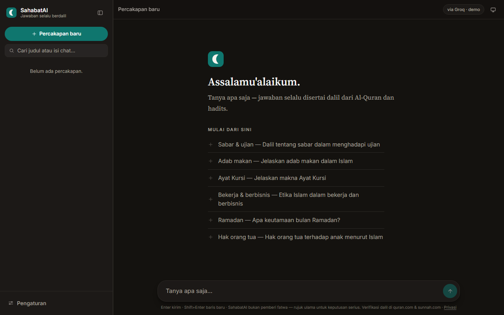
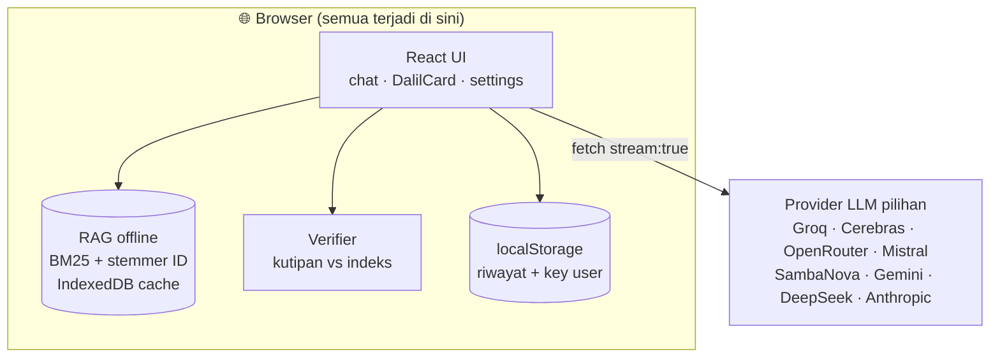

# 🕌 SahabatAI — AI Ngobrol Islam yang Wajib Bawa Dalil

**Tanya apa saja — jawaban selalu berdalil: Al-Quran, hadits, kaidah ulama.**

---

## ❌ Masalahnya

- Nanya soal agama ke AI umum → jawaban sering **tanpa dalil** atau **mengarang nomor ayat** (halusinasi)
- Solusi chatbot Islam kebanyakan butuh **akun + server** — data percakapan ke mana-mana
- Pertanyaan sensitif butuh **sumber yang bisa diverifikasi**, bukan sekadar yakin

## ✅ SahabatAI

Web app chat AI berbahasa Indonesia yang **wajib menyertakan dalil** — dan dalil itu **disalin dari indeks offline di browser**, bukan hafalan model, lalu **diverifikasi dua arah** terhadap indeks yang sama. Halusinasi nomor ayat? Tertandai otomatis di footer pesan.

### ✨ Fitur

- 📖 **DalilCard** — teks Arab (font Amiri) + terjemahan + tombol salin + link langsung ke quran.com / sunnah.com
- 🔍 **RAG offline BM25** — 6.236 ayat + 26.892 hadits (5 kitab) terindeks di browser; stemmer Bahasa Indonesia ("saudara" menemukan "saudaranya")
- ✅ **Verifikasi dua arah** — kutipan model dicek terhadap indeks; yang tidak cocok ditandai
- 💬 **Streaming tanpa SDK LLM** — SSE di-parse sendiri; typewriter adaptif yang hormat `prefers-reduced-motion`
- 🔗 **Bagikan jawaban** — link berisi Q&A lengkap + preview rapi di WhatsApp/Telegram (OG meta dinamis, tanpa database)
- 🔌 **Multi-provider + failover 429** — Groq, Cerebras, OpenRouter, Mistral, SambaNova, Gemini, DeepSeek, Anthropic — kuota habis? Seklik pindah provider
- 🔑 **Dua mode key** — demo langsung pakai, atau BYOK (key user disimpan lokal, dikirim langsung ke provider)
- 🗂️ Riwayat multi-chat: pencarian (tahan diakritik/harakat), rename, ekspor Markdown

## 🏗️ Arsitektur

**100% client-side — tanpa backend, tanpa akun, tanpa tracking.**

- **Stack:** Vite + React + TypeScript · zustand · react-markdown · CSP produksi ketat (vercel.json)
- **Privasi:** satu-satunya data yang keluar dari browser adalah pertanyaan kamu — dikirim langsung ke provider yang kamu pilih. Rincian: [/privasi.html](https://sahabat-ai-alpha.vercel.app/privasi.html)

> ⚠️ **Disclaimer:** SahabatAI bukan pemberi fatwa. Setiap dalil bisa diverifikasi seklik ke quran.com / sunnah.com. Untuk keputusan agama serius, konsultasikan ke ustadz/ulama/lembaga fatwa resmi.

---

## 🔒 Tentang Source Code

Repository ini adalah **showcase** — dokumentasi produk, bukan kode sumber.
Source code SahabatAI tidak dipublikasikan dan semua hak dilindungi. Lihat [`LICENSE`](LICENSE).
App-nya sendiri bisa dicoba langsung: **[sahabat-ai-alpha.vercel.app](https://sahabat-ai-alpha.vercel.app)**

> 💬 Kolaborasi atau lisensi? Hubungi [Kandar Lubis](https://github.com/kandarlubis31).

---

© 2026 Kandar Lubis — All Rights Reserved.
